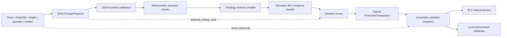

# Ontology proposal and projection boundary

This contract turns model, connector, Drive, DeepWiki, Replit, and operator suggestions into typed **proposals** without granting any of those surfaces authority over canonical ontology state.

## Authority rule

A `ChangeProposal`:

- binds the exact source snapshot digest and target schema version;
- declares one `mindId` and one object family;
- carries bounded typed operations, evidence, expected semantic effects, and rollback intent;
- has an exact authority ceiling of `none`;
- cannot mutate canon, approve itself, or waive the later promotion transaction;
- is only input to deterministic validation, semantic closure, evidence review, and governed promotion.

The compiler and promotion transaction remain outside the proposal producer. GitHub is the review and evidence surface. Google Drive is an artifact shuttle and change hint. DeepWiki is a read-only reconciliation surface. Supabase and Replit are projections. OpenAI and other models may generate, critique, or evaluate proposals but cannot promote them.

## Polycentric mind invariant

`Model` is a replaceable cognitive organ or population. `Mind` is the persistent recurrent organization that binds identity, goals, shared workspace, Atlas belief state, Forge executive state, memory, dissent, embodiment, and continuity. A proposal that collapses a model into the whole mind must be rejected.

## Next compiler slice

The next implementation may consume a valid proposal and a pinned snapshot, but it must still fail closed unless it can emit:

1. the canonicalized input digest;
2. a deterministic semantic diff;
3. complete dangling-reference and authority-monotonicity checks;
4. a closure receipt bound to the exact compiler version;
5. a rollback candidate bound to the predecessor snapshot;
6. a promotion-review bundle with no action authority.
