# Ontology proposal, closure, projection, and authorized admission boundary

This contract turns model, connector, Drive, DeepWiki, Replit, operator, and internal-system suggestions into typed **proposals** without granting any proposal producer direct authority over canonical ontology state.

## Authority rule

A `ChangeProposal`:

- binds the exact source snapshot digest and target schema version;
- declares one `mindId` and one object family;
- carries bounded typed operations, evidence, expected semantic effects, and rollback intent;
- has an exact authority ceiling of `none`;
- cannot mutate canon, approve itself, or waive the later promotion transaction;
- is only input to deterministic validation, semantic closure, evidence review, executive decision, and governed admission.

The compiler and admission executor remain outside the proposal producer. GitHub is a review and evidence surface. Google Drive is an artifact shuttle and change hint. DeepWiki is read-only reconciliation. Supabase and Replit are projections. OpenAI and other individual models may generate, critique, or evaluate proposals but cannot individually promote them.

The persistent Pleiades Mind may authorize bounded admission when a promoted `DelegatedAuthorityGrant` and authorization policy permit it. This is a real executive decision, not a recommendation awaiting an operator click.

```mermaid
flowchart LR
    Sources["Drive • DeepWiki • Replit • operator • internal services • models"] --> Proposal["Strict ChangeProposal"]
    Proposal --> Shape["JSON Schema validation"]
    Shape --> Semantics["Deterministic semantic checks"]
    Semantics --> Closure["Ontology closure compiler"]
    Closure --> Receipt["Candidate snapshot + semantic diff + closure receipt"]
    Receipt --> Manifest["Exact SourceManifest\ncommit + artifact hashes"]
    Manifest --> Candidate["OntologyPromotionCandidate\nauthority ceiling: none"]
    Candidate --> Gate["Deterministic PromotionGateReport"]
    Gate -->|blocked| Repair["Resolve explicit blockers"]
    Gate -->|eligible| Policy{"Authorization policy"}
    Policy -->|delegated machine| Mind["Polycentric ExecutiveDecision"]
    Policy -->|mixed quorum| Mixed["Mind + required external approvals"]
    Policy -->|reserved human| Human["Constitutional steward process"]
    Mind --> Mandate["AdmissionMandate"]
    Mixed --> Mandate
    Human --> Mandate
    Mandate --> Executor["Capability-bound executor\ndecision authority: none"]
    Executor --> Snapshot["Immutable admitted snapshot"]
    Snapshot --> Supabase["RLS read projection"]
    Snapshot --> Substrate["Local enforcement substrate"]

    Sources -. "never self-admit" .-> Snapshot
    Gate -. "cannot decide or execute" .-> Mandate
```

## Polycentric mind invariant

`Model` is a replaceable cognitive organ or population. `Mind` is the persistent recurrent organization that binds identity, goals, shared workspace, Atlas belief state, Forge executive state, memory, dissent, embodiment, and continuity. A proposal that collapses a model into the whole mind must be rejected.

Machine executive authorization must therefore be produced by recurrent, typed deliberation with independent first-pass contributions, risk and policy roles, evidence binding, and preserved dissent. A single model response cannot constitute the executive decision.

## Exact promotion-evidence seam

The promotion-evidence layer adds three contracts beneath authorization:

1. `OntologySourceManifest` pins the exact subject repository, branch, commit, source snapshot, proposal, compiler, contracts, candidate snapshot, and closure receipt by non-placeholder SHA-256 identities.
2. `OntologyPromotionCandidate` binds those immutable inputs to the semantic-diff digest, governance evidence, unresolved blocking issues, and an explicit authorization policy.
3. `OntologyPromotionGateReport` deterministically reports either `blocked` or `eligible-for-authorized-decision` while preserving an authority ceiling of `none`.

An authorization policy may choose:

- `delegated-machine-executive`: zero contemporaneous human approvals, but an active delegated grant and machine executive decision are required;
- `mixed-quorum`: the Mind participates as an executive principal together with the required external approvals;
- `human-steward`: reserved constitutional or otherwise policy-designated decisions.

The checked-in foundational candidate intentionally preserves `github:Zheke32174/pleiades#42` as an unresolved blocker and uses `mixed-quorum`. The golden gate report is therefore `blocked`. Clearing the blocker only makes the candidate eligible for the selected authorized decision process; it does not self-promote.

## Executive authority and execution

`modos/EXECUTIVE_AUTHORITY.md` defines the risk ladder, delegated powers, reserved powers, authority growth, and separation of decision from execution.

A successful machine executive path requires:

1. an active, revocable, domain-scoped `DelegatedAuthorityGrant`;
2. an evidence-bound `ExecutiveDecision` from the persistent Mind;
3. risk and action coverage inside the grant;
4. a pinned predecessor and rollback plan;
5. a capability-bound `AdmissionMandate`;
6. an executor with no decision authority and no ability to alter the target or enlarge scope.

## Deliberate remaining boundary

This layer does not configure a live GitHub ruleset, resolve issue #42, merge a pull request, apply the Supabase projection migration, execute an admission mandate, or mutate a live canonical snapshot. It defines and validates how machine, mixed, and human authority may legitimately authorize those later actions.
