# Ontology proposal, closure, projection, and promotion-evidence boundary

This contract turns model, connector, Drive, DeepWiki, Replit, and operator suggestions into typed **proposals** without granting any of those surfaces authority over canonical ontology state.

## Authority rule

A `ChangeProposal`:

- binds the exact source snapshot digest and target schema version;
- declares one `mindId` and one object family;
- carries bounded typed operations, evidence, expected semantic effects, and rollback intent;
- has an exact authority ceiling of `none`;
- cannot mutate canon, approve itself, or waive the later promotion transaction;
- is only input to deterministic validation, semantic closure, evidence review, and governed promotion.

The compiler and signed promotion transaction remain outside the proposal producer. GitHub is the review and evidence surface. Google Drive is an artifact shuttle and change hint. DeepWiki is a read-only reconciliation surface. Supabase and Replit are projections. OpenAI and other models may generate, critique, or evaluate proposals but cannot promote them.

```mermaid
flowchart LR
    Sources["Drive • DeepWiki • Replit • operator • models"] --> Proposal["Strict ChangeProposal"]
    Proposal --> Shape["JSON Schema validation"]
    Shape --> Semantics["Deterministic semantic checks"]
    Semantics --> Closure["Ontology closure compiler"]
    Closure --> Receipt["Candidate snapshot + semantic diff + closure receipt"]
    Receipt --> Manifest["Exact SourceManifest\ncommit + artifact hashes"]
    Manifest --> Candidate["OntologyPromotionCandidate\nauthority ceiling: none"]
    Candidate --> Gate["Deterministic PromotionGateReport"]
    Gate -->|blocked| Repair["Resolve explicit blockers"]
    Gate -->|eligible| Review["CODEOWNERS + ruleset + steward review"]
    Review --> Promotion["Signed PromotionTransaction"]
    Promotion --> Snapshot["Immutable admitted snapshot"]
    Snapshot --> Supabase["RLS read projection"]
    Snapshot --> Substrate["Local enforcement substrate"]

    Sources -. "never canonical" .-> Snapshot
    Gate -. "cannot sign or admit" .-> Promotion
```

## Polycentric mind invariant

`Model` is a replaceable cognitive organ or population. `Mind` is the persistent recurrent organization that binds identity, goals, shared workspace, Atlas belief state, Forge executive state, memory, dissent, embodiment, and continuity. A proposal that collapses a model into the whole mind must be rejected.

## Exact promotion-evidence seam

The promotion-evidence layer adds three contracts beneath steward review:

1. `OntologySourceManifest` pins the exact subject repository, branch, commit, source snapshot, proposal, compiler, contracts, candidate snapshot, and closure receipt by non-placeholder SHA-256 identities.
2. `OntologyPromotionCandidate` binds those immutable inputs to the semantic-diff digest, governance evidence, unresolved blocking issues, and required review policy.
3. `OntologyPromotionGateReport` deterministically reports either `blocked` or `eligible-for-steward-review` while preserving an authority ceiling of `none`.

The checked-in candidate intentionally preserves `github:Zheke32174/pleiades#42` as an unresolved blocker. The golden gate report is therefore `blocked`. Clearing the array in a test proves that the same exact evidence set becomes only `eligible-for-steward-review`; it still cannot self-promote or mutate canon.

## Deliberate remaining boundary

This layer does not verify a cryptographic steward signature, configure a GitHub ruleset, merge a pull request, apply the Supabase projection migration, admit a snapshot to the local substrate, or perform canonical mutation. Those operations require a later signed `PromotionTransaction` and an external steward-controlled admission executor.
